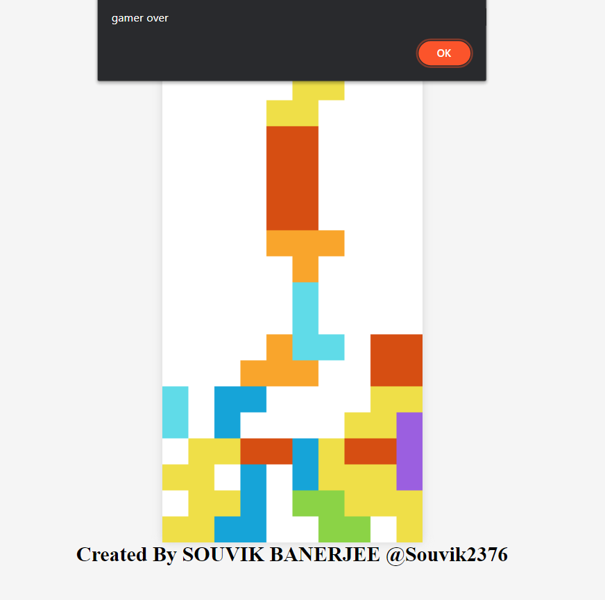

# Tetris_Game
Tetris Game using JavaScript, HTML and CSS



Play the Game in browser via ⏭️
Copy the Following Link and Open in your Browser.

```
https://github.com/Souvik2376/Tetris-Game
```

    HOW TO PLAY ⏭️
```  
  ⬆️ Up-Arrow (Rotate)
  ⬅️ Left-Arrow (Move Left)
  ➡️ Right-Arrow (Move Right)
  ⬇️ Down-Arrow (Increase Down Speed)
```

  Steps To Setup on Your Device 😀
 
 ```
  1. Clone the repository ©️
        Open Terminal on a New Empty Folder.
        copy the following command on the terminal and Enter ->  https://github.com/Souvik2376/Tetris-Game.git


  2. Open The Created Folder via VsCode 🆚
  
  3. Play The Game by open with Live Server on LocalHost 🎭▶️⏯️

  4. Up Arrow key (ROTATE) functionality uses the concept of Matrix Rotation.
```
